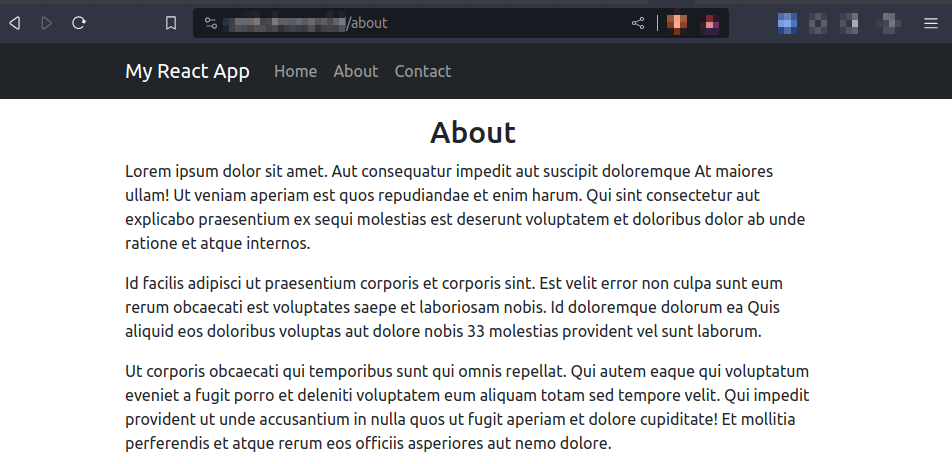

# React application

A sample React application built to demonstrate serving static files with Caddy.

**Tutorial**:
[Deploying Web Apps with Caddy: A Beginner's Guide](https://betterstack.com/community/guides/web-servers/caddy/)

## ⚖ License

The code used in this project and in the linked tutorial are licensed under the
[Apache License, Version 2.0](LICENSE)
